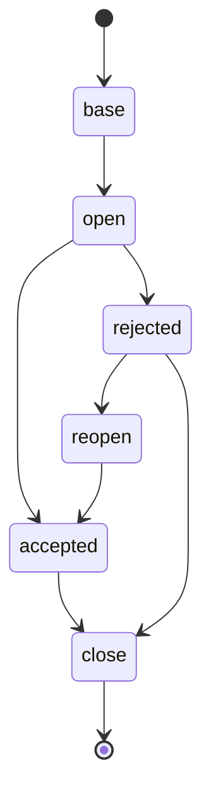

# rust-functional-practice

状態遷移をなんかいい感じにRustで書けないか練習してみる

## memo

たとえばこんな感じのをいい感じに書けないかなと思っている

一旦こんな感じだとする

- base something
  - id
  - name
- open something
  - base something
  - open id
  - open reason
- accepted something
  - base something
  - accepted id
  - accepted reason id
- close something
  - base something
  - close id
  - close datetime

